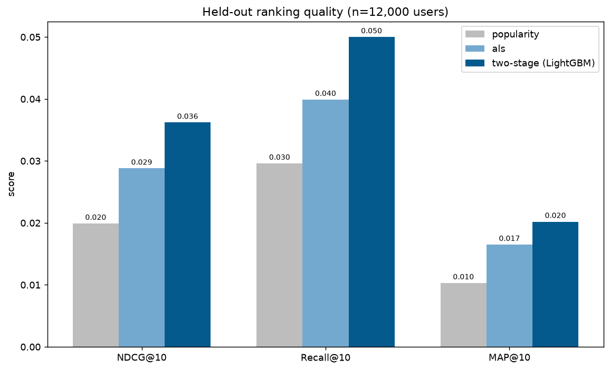
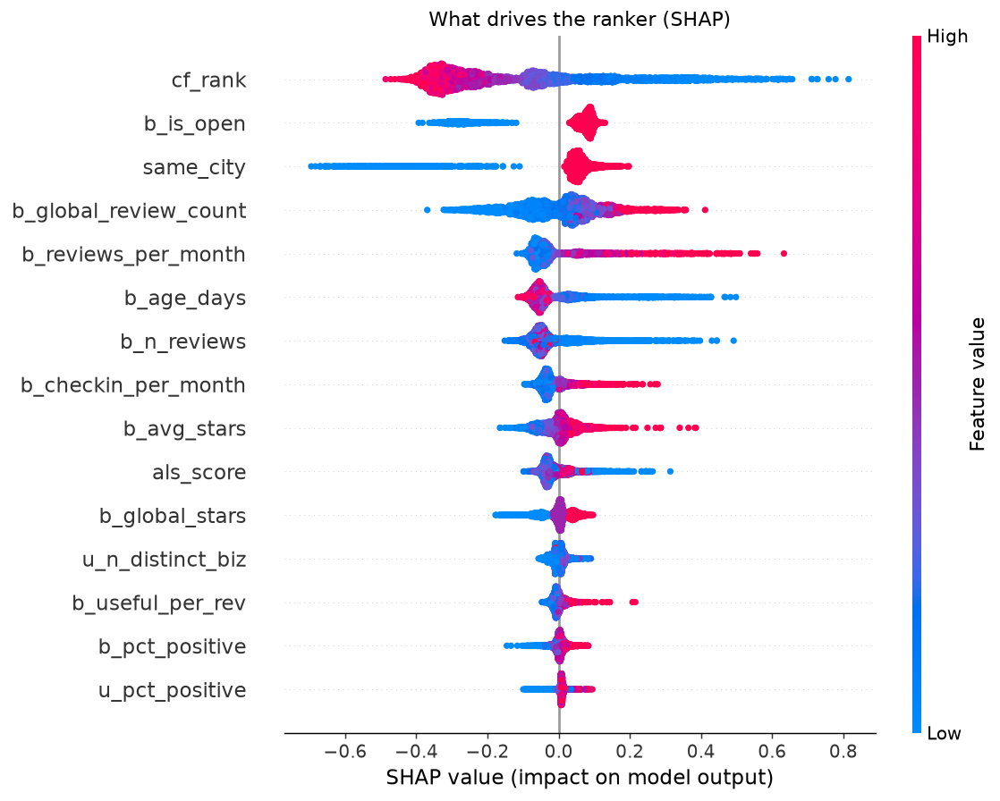

# Yelp Recommender & Semantic Search

Two systems built on the [Yelp Open Dataset](https://www.yelp.com/dataset)
(~7M reviews, 150k businesses, 2M users):

1. **A two-stage restaurant recommender** — ALS generates candidates, a LightGBM
   LambdaMART model reranks them. Evaluated on a held-out *future* window.
2. **A semantic search engine** over review text — a fine-tuned sentence encoder
   with a FAISS index, plus per-user taste profiles.

Everything runs locally on a sample of five metros; the code is written to scale
to the full dataset by changing a few values in [`src/config.py`](src/config.py).

---

## Results

### Recommendation — held-out test period, 12,000 users

The dataset is split chronologically: models are fit on the past and scored on
reviews from a later, unseen window. We compare a popularity baseline, ALS alone
(stage 1), and the full two-stage system.

| method | NDCG@10 | Recall@10 | MAP@10 |
| --- | --- | --- | --- |
| Popularity | 0.0199 | 0.0296 | 0.0103 |
| ALS only | 0.0288 | 0.0399 | 0.0165 |
| **Two-stage (LightGBM)** | **0.0362** | **0.0500** | **0.0202** |

Reranking with LightGBM lifts **NDCG@10 by ~25% over ALS alone** and ~82% over
the popularity baseline. (Absolute scores are modest because the task — naming
the exact restaurants a user visits next, out of ~14k — is genuinely hard; the
relative lift between methods is the point.)



### Semantic search — fine-tuning lift on unseen businesses

Same-business retrieval on 1,500 queries from 2,053 businesses the encoder never
saw during fine-tuning (does another review of the same place surface in the
top-10?):

| encoder | Hit@10 | MRR@10 |
| --- | --- | --- |
| MiniLM (base) | 0.169 | 0.103 |
| **fine-tuned** | **0.225** | **0.138** |

In-domain fine-tuning lifts **Hit@10 by ~33%** and MRR@10 by ~34% on unseen
businesses — adapting a general encoder to the way people write about
restaurants.

---

## How it works

### Data preparation — [`src/recsys/prepare.py`](src/recsys/prepare.py)

Filter to dining businesses in five metros (Philadelphia, Tampa, Indianapolis,
Nashville, New Orleans), stream the 5 GB review file keeping only those, apply
iterative **k-core filtering** (≥5 reviews/user, ≥10/business) for a dense
matrix, then split by date into train / valid / test. Result: **1.2M
interactions, 85k users, 14k businesses.**

### Stage 1 — ALS candidate generation — [`src/recsys/candidates.py`](src/recsys/candidates.py)

Alternating Least Squares factorises the user×business implicit-feedback matrix
(confidence scaled by how much each user liked a place). For each user it returns
the 100 businesses most likely to be relevant — narrowing 14k options to a short
list the ranker can afford to score in detail.

### Stage 2 — LightGBM ranking — [`src/recsys/ranker.py`](src/recsys/ranker.py)

A LambdaMART model reranks the candidates, optimising NDCG directly (which ALS
does not). The ALS rank/score is the backbone signal; the engineered features
provide the corrections that earn the lift.

### Features — [`src/recsys/features.py`](src/recsys/features.py)

~40 features in three groups, all computed from data strictly before the
prediction window:

- **User** (14) — rating behaviour, activity, tenure, elite status, the kind of
  places they pick (popularity, price, ratings).
- **Business** (22) — in-window rating stats, popularity and review velocity,
  age, check-in and tip volume, price, and amenity flags (takeout, delivery,
  reservations, …).
- **Cross** (6) — ALS score and rank, star gap, price gap, same-city and
  same-cuisine matches.

### Interpretability — [`src/recsys/explain.py`](src/recsys/explain.py)

SHAP over the held-out candidates shows *why* the ranker promotes a place: the
ALS rank anchors the order, while open status, same-city matching, popularity,
review velocity and recency do the reranking work.



### Semantic search — [`src/search/`](src/search)

A MiniLM sentence encoder is fine-tuned on in-domain review pairs (two reviews of
the same business should embed close together) with a contrastive loss. Reviews
are embedded and indexed in FAISS; a free-text query like *"cozy spot with great
oat-milk lattes"* is matched on meaning and pooled back to the businesses it
describes.

### Taste profiles — [`src/search/taste_profiles.py`](src/search/taste_profiles.py)

Each user's liked places are distilled into a structured summary and a *taste
vector* (the centroid of those places' embeddings), which drives a content-based
"more places you'd like." The profile is written locally by default, or by Claude
if `ANTHROPIC_API_KEY` is set.

---

## Repo layout

```
src/
  config.py            knobs: cohort, k-core, split, model sizes
  data_loader.py       JSON loaders          (+ EDA in analysis.py, visualizations.py)
  recsys/
    prepare.py         interaction table + temporal split
    features.py        ~40 user/business/cross features
    candidates.py      ALS + ranking-frame assembly
    ranker.py          LightGBM LambdaMART
    evaluate.py        NDCG / Recall / MAP
    explain.py         SHAP + result plots
  search/
    corpus.py          review text corpus
    embed.py           encoding, fine-tuning, retrieval eval
    index.py           FAISS helpers
    search.py          query-time search engine
    taste_profiles.py  taste summaries + content-based recs
pipelines/
  train_recommender.py  end-to-end recommender train + eval
  build_search.py       fine-tune + build index
  run_all.py            run everything in order
app.py                  Streamlit dashboard (EDA + all three ML demos)
```

## Running it

```bash
python -m venv .venv && source .venv/bin/activate
pip install -r requirements.txt
# download the Yelp dataset into data/ (yelp_academic_dataset_*.json)

python pipelines/run_all.py        # data prep → recommender → search (~30 min)
streamlit run app.py               # interactive dashboard
```

The dataset is not committed (it's ~10 GB). Get it from
<https://www.yelp.com/dataset>.

## Notes

- **No leakage.** All behavioural features come from the window before the period
  being predicted; the final test uses train+valid history to predict the test
  window. A few static profile fields (account age, elite status) are treated as
  metadata.
- **Sampled for tractability.** Five metros and a 120k-review search index keep a
  full run to ~30 minutes on a laptop. Scaling up is a config change.
